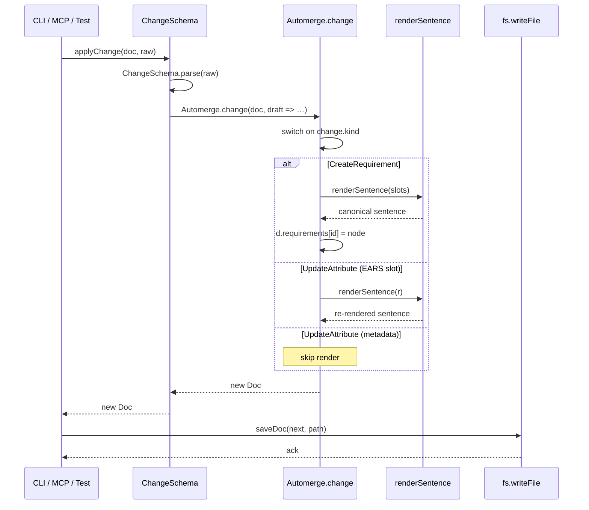
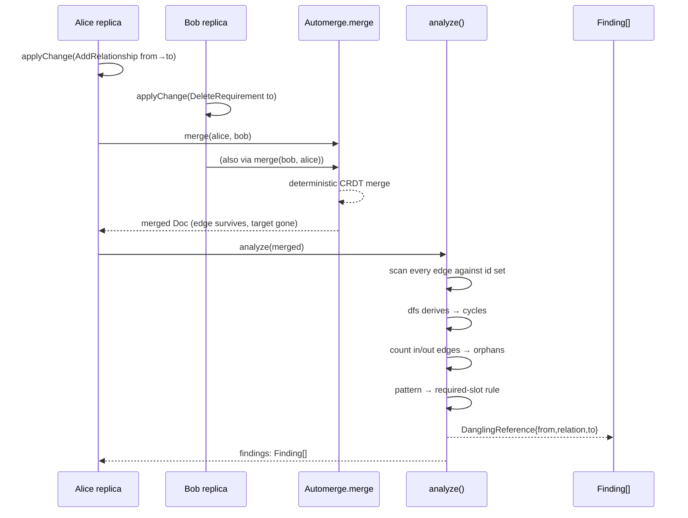
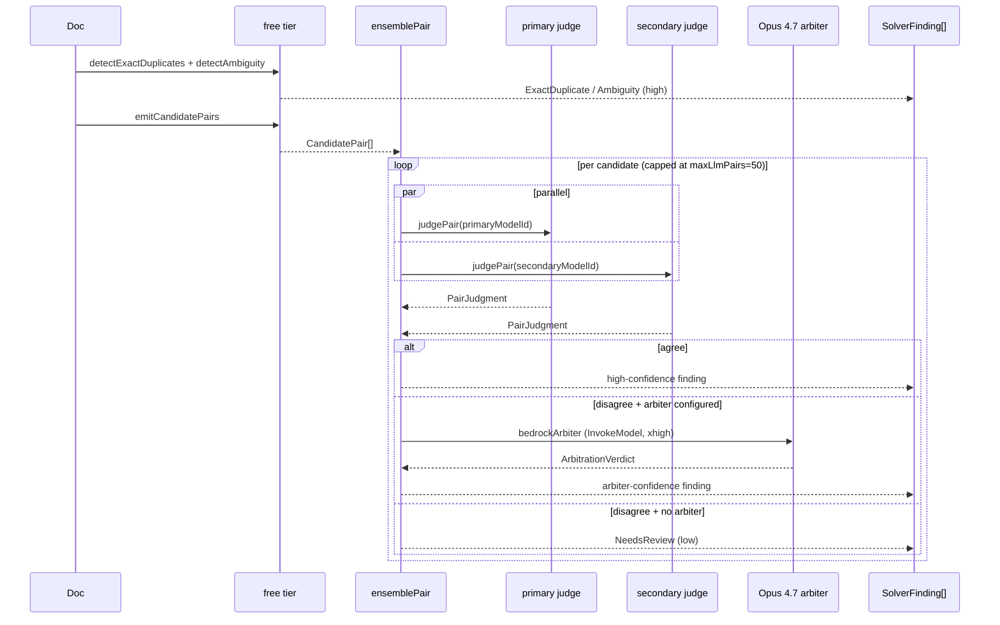

# symspec · Data flow

Three flows describe the lifecycle of a Change record from caller through CRDT to disk and back through analysis. Citations point at the orchestrating function in each stage.

## 1. Author → render → persist (single-replica)

The hot path: an MCP tool call or CLI command produces a `Change`, the Automerge wrapper applies it, the renderer re-renders the sentence on EARS-slot edits, the doc is saved.

Entry points are `src/cli/index.ts:57-76` (CLI `add`), `src/mcp/server.ts:70-89` (MCP `requirement_create`), or `scripts/smoke*.ts` directly. The discriminated-union switch lives at `src/core/doc.ts:62-159`. The render guard for EARS slots is at `src/core/doc.ts:118-126`.

## 2. Concurrent replicas → CRDT merge → analyze

The convergence path: two replicas of the same base diverge with concurrent edits, Automerge merges deterministically, the analysis pass surfaces what the CRDT couldn't prevent (the canonical case is Alice adding an edge to a node Bob deleted).

The smoke test asserts the dangling-reference outcome at `scripts/smoke.ts:163-171` and asserts merge-order equivalence at `scripts/smoke.ts:184-198`. The merge function is exposed for demonstration even though Automerge does it implicitly (`src/core/doc.ts:172-174`). The four-way analysis loop is at `src/core/analyze.ts:29-65`, cycle detection at `src/core/analyze.ts:67-76`, orphan counting at `src/core/analyze.ts:79-97`.

## 3. Solver pipeline — free → ensemble → arbiter

The semantic-validation path: the free tier emits findings + candidate pairs, the LLM tier judges each candidate with two models in parallel, agreements emit high-confidence findings, disagreements escalate to Opus 4.7 or fall back to `NeedsReview`.

The orchestrator runs the free tier first and drops candidates already flagged as exact duplicates (`src/solvers/index.ts:55-71`). The pair-ensemble parallelism is at `src/solvers/llm/ensemble.ts:45-49`. The arbiter branch is at `src/solvers/llm/ensemble.ts:57-68`; the `NeedsReview` fallback at `src/solvers/llm/ensemble.ts:70-79`. The arbiter sends Opus 4.7 a system prompt + XML-tagged user message containing both prior judgments, and forces a `report_arbitration` tool call (`src/solvers/llm/arbiter.ts:111-141`, `src/solvers/llm/arbiter.ts:215-259`, `src/solvers/llm/arbiter.ts:276-328`).

## See also

- [Processes](../behavior/processes.md)
- [Behavioral sequences](../diagrams/behavioral/sequences.md)
- [Contract map](../insights/contract-map.md)
- [Tech debt register](../insights/tech-debt.md)
