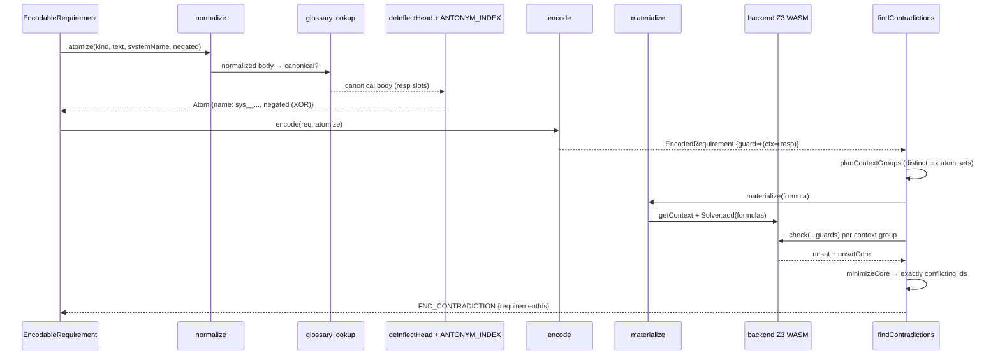
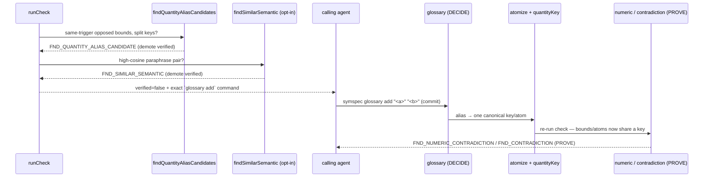

# symspec · Data flow

How a requirements document moves through `symspec check` — from bytes on disk to a typed envelope carrying the DEMOTION-ONLY verdict — and the internal flows that turn a fuzzy proposal into a real z3 proof.

## Flow 1 — The `check` pipeline

`symspec check` runs a strictly-ordered tier stack: load and validate the document, run structural analysis, GtWR lint, and the always-on ambiguity family, gate statements before symbolization, then the formal tiers, all folded into one `CheckReport` whose `verified` flag is `demotions.length === 0` (`src/pipeline/check.ts:1289`). The order is forced — `parse → lint → symbolize → solve` — so the propositional SMT layer never receives unsound input (`src/pipeline/check.ts:23-30`).

The CLI reads the file through the single validation funnel `loadRequirementsDoc` (`src/core/load.ts:106`), which throws typed `ERR_DOC_PARSE` / `ERR_SCHEMA_VERSION` on malformed input, then calls `runCheck` (`src/pipeline/check.ts:678`). `runCheck` layers findings in fixed order: Tier-0 structural via `analyze` (`src/pipeline/check.ts:682`), GtWR lint per-statement and set-level (`src/pipeline/check.ts:684`), the deterministic always-on ambiguity family (`src/pipeline/check.ts:691`), then the waiver-aware AC-3-7 gate `gateRequirements` partitions out unsound statements (`src/pipeline/check.ts:708`). Inside the injected formal closure it runs the propositional checks over the gate-INCLUDED subset — contradiction, subsumption, vacuity, completeness, similar-ununified, needs-review (`src/pipeline/check.ts:781-791`); the numeric/arithmetic tier over ALL requirements (`src/pipeline/check.ts:822`); the two propose-only blind-spot detectors — quantity-alias candidates and relational-unchecked shapes — over ALL requirements (`src/pipeline/check.ts:835,856`); the opt-in bounded temporal tier over ALL requirements when `--temporal` is set (`src/pipeline/check.ts:873`); and the opt-in `--semantic` paraphrase pass, opposition detector, and embedding graph over the included subset (`src/pipeline/check.ts:886-916`). Unsat-triggered findings gain their atom-table evidence via `attachEvidenceToAll` (`src/pipeline/check.ts:930`).

The verdict is DEMOTION-ONLY. After findings are tallied, `runCheck` accumulates a `demotions` list: an uncovered (all-singleton) requirement, each gate-excluded requirement (driven by the gate's `excluded` set, not the post-waiver findings), each kept quantity-alias candidate, each relational-unchecked shape, each open opposition candidate, a no-decide-tier-comparison case, and a skipped semantic tier (`src/pipeline/check.ts:1200-1288`). `verified = demotions.length === 0` (`src/pipeline/check.ts:1289`). Propose-only and coverage-gap codes can only push `verified` toward `false`; only a z3 UNSAT result promotes.

```mermaid
sequenceDiagram
    participant CLI as cli/index.ts
    participant Load as core/load.ts
    participant Run as runCheck
    participant Gate as pipeline/gate.ts
    participant SMT as SMT propositional
    participant Num as numeric + alias + relational
    participant Sem as semantic + graph
    participant Cov as coverage + demotions
    participant Env as cli/envelope.ts
    CLI->>Load: loadRequirementsDoc(path)
    Load-->>CLI: validated Doc (or ERR_DOC_PARSE)
    CLI->>Run: runCheck(doc, opts)
    Run->>Run: structural + GtWR lint + ambiguity (always-on)
    Run->>Gate: gateRequirements(reqs, waivers)
    Gate-->>Run: {included, excluded} (waiver-aware)
    Run->>SMT: encode+solve INCLUDED subset only
    SMT-->>Run: contradiction/subsumption/vacuity + evidence
    Run->>Num: numeric over ALL; alias + relational PROPOSE (demote)
    Num-->>Run: FND_NUMERIC / QUANTITY_ALIAS_CANDIDATE / RELATIONAL_UNCHECKED
    Run->>Sem: semantic + opposition + graph over INCLUDED (opt-in)
    Sem-->>Run: FND_SIMILAR_SEMANTIC / OPPOSITION_CANDIDATE (propose)
    Run->>Cov: build demotions; verified = demotions.length === 0
    Cov-->>Run: CheckReport {findings, coverage, verified}
    Run-->>CLI: CheckReport
    CLI->>Env: success('check', report)
    Env-->>CLI: {apiVersion, type:'check', data}
```

## Flow 2 — atomize → encode → SMT

A requirement's text only becomes a solver conflict through `atomize`, the single pure function that turns an EARS slot into a Boolean atom (`src/formal/atomize.ts:227`). Two requirements conflict exactly when their responses resolve to the SAME atom with opposite polarity, which makes this the load-bearing soundness component.

`atomize` normalizes conservatively — lowercase, strip one leading article, strip punctuation, underscore-join (`normalize` `src/formal/atomize.ts:146`) — then applies glossary canonicalization FIRST, so an agent-confirmed alias is rewritten to its canonical phrase before the leading response verb is de-inflected by the closed vendored rules in `lemma.ts` (`deInflectHead` `src/formal/lemma.ts:186`) and antonym unification runs (`src/formal/atomize.ts:23-29`). `encode` threads each requirement through the injected atomizer and builds the guarded-implication formula `guard ⇒ (context ⇒ response)` (`src/formal/encode.ts:205`) as a pure, Z3-free AST. `findContradictions` (`src/formal/contradiction.ts:230`) then plans context groups (`planContextGroups` `src/formal/contradiction.ts:141`), materializes formulas into Z3 `Bool` expressions (`materialize` `src/formal/encode.ts:260`), and per group asserts that group's context atoms while checking all guards, extracting and minimizing the unsat core (`minimizeCore` `src/formal/contradiction.ts:190`). Z3 runs in-process on WASM via `getContext` (`src/formal/backend.ts:58`), memoized to init once per process (~110 ms, `src/formal/backend.ts:12-16`).



## Flow 3 — PROPOSE → DEMOTE → commit → PROVE

Every fuzzy signal follows one loop: a propose-only tier raises the alarm and DEMOTES `verified`, an agent commits a reviewed artifact, and the sound tier then PROVES the conflict. Two propose sources drive it — embedding paraphrases and quantity-alias candidates — and neither ever asserts a conflict itself.

**Quantity-alias (deterministic PROPOSE, no model).** The numeric tier keys a quantity off the noun phrase before the comparator, so one physical quantity described with two verbs ("complete the infusion within ≤30 min" vs "run the infusion for ≥60 min") splits into two keys and the joint `≤30 ∧ ≥60` UNSAT is never seen (`src/formal/quantity-alias.ts:1-46`). `findQuantityAliasCandidates` (`src/formal/quantity-alias.ts:160`) flags same-system + same-trigger opposed bounds whose labels share an object suffix but differ in verb (`sharedObjectSuffix` `:132`, `opposed` `:114`), emitting `FND_QUANTITY_ALIAS_CANDIDATE` with the exact `symspec glossary add "<a>" "<b>"` command and adding a `quantity-alias-candidate` demotion (`src/pipeline/check.ts:1234`). Committing the alias feeds the glossary index into `atomize`/`quantityKey`, so the LIA tier keys both bounds together and `findNumericContradictions` proves the real `FND_NUMERIC_CONTRADICTION` — closing the loop the eval's reproducer-a fixture asserts end-to-end.

**Semantic paraphrase (embedding PROPOSE, opt-in).** `findSimilarSemantic` (`src/formal/semantic.ts:135`) is opt-in (`check --semantic`); the CLI lazily loads the embedder only then, so the default `check` never touches the model. `loadEmbedder` (`src/formal/embed.ts:240`) resolves the pinned `Xenova/bge-base-en-v1.5` assets through `ensureModelAssets` (`src/formal/model-cache.ts:177`), which sha256-verifies every cached file and throws `ERR_EMBED_MODEL_MISSING` on a miss. For each same-system pair not already unified by `atomize`, it embeds both responses (CLS-pooled, L2-normalized so dot product is cosine — `cosine` `src/formal/embed.ts:267`) and, above threshold 0.72 (`DEFAULT_SEMANTIC_THRESHOLD` `src/formal/semantic.ts:110`), emits info `FND_SIMILAR_SEMANTIC` suggesting `symspec glossary add`; a same-trigger high-cosine pair also gets an inline `antonym add` hint. Only after the agent commits the entry does the glossary index feed back into `atomize`, collapsing the paraphrases onto one atom so Flow 2 can prove the conflict.



The relational blind-spot detector (`findRelationalUnchecked` `src/formal/relational.ts:100`) rides the same demotion path but has no commit-to-prove step: the aggregate/conservation and emergent-structural families it recognizes are not soundly recoverable by a deterministic extractor, so it emits `FND_RELATIONAL_UNCHECKED` with an honest "reasoning not attempted" caveat that the agent discharges by hand-verifying and waiving, or by restating the constraint as a same-quantity bound the solver can check (`src/pipeline/check.ts:1248`).

## See also

- [Module map](module-map.md) — 12 shared source citations
- [Contract map](../insights/contract-map.md) — 9 shared source citations
- [Processes](../behavior/processes.md) — 8 shared source citations
- [Public API](../reference/public-api.md) — 8 shared source citations
- [Component diagram](../diagrams/architecture/components.md) — 7 shared source citations
