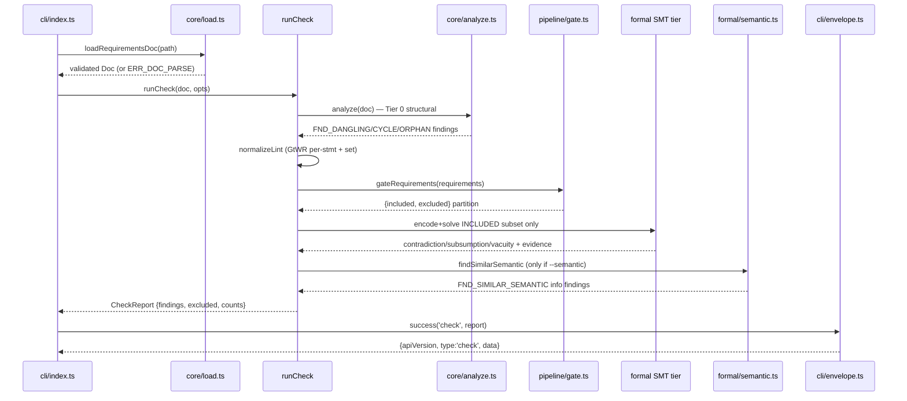
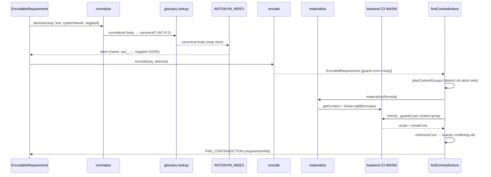
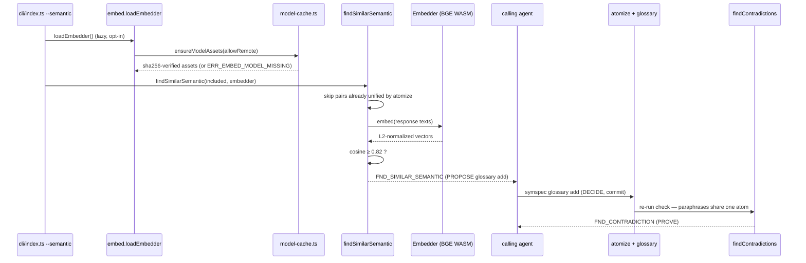

# symspec · Data flow

How a requirements document moves through `symspec check` — from bytes on disk to a typed envelope — and the two internal flows that make paraphrased contradictions provable.

## Flow 1 — The `check` pipeline

`symspec check` runs a strictly-ordered tier stack: load and validate the document, run structural analysis, gate statements before symbolization, then the SMT formal tier, with an optional semantic pass, all folded into one `CheckReport`. The order is forced — `parse → lint → symbolize → solve` — so the SMT layer never receives unsound input (`src/pipeline/check.ts:23-30`).

The CLI reads the file through the single validation funnel `loadRequirementsDoc` (`src/core/load.ts:106-109`), which throws typed `ERR_DOC_PARSE` / `ERR_SCHEMA_VERSION` errors on malformed input (`src/core/load.ts:61-100`). It then calls `runCheck` (`src/pipeline/check.ts:293`) and wraps the result via `success('check', …)` (`src/cli/index.ts:397-404`). `runCheck` layers findings in fixed order: Tier-0 structural via `analyze` (`src/pipeline/check.ts:297`, `src/core/analyze.ts:27`), GtWR lint per-statement and set-level (`src/pipeline/check.ts:300`, `src/lint/gtwr.ts` (885 LOC)), the AC-3-7 exclusion gate `gateRequirements` (`src/pipeline/check.ts:303`, `src/pipeline/gate.ts:125`) whose `error`-severity surface checks partition out unsound statements (`src/pipeline/gate.ts:97-117`), then the formal SMT tier inside the `runSolvers` closure (`src/pipeline/check.ts:313-397`) — contradiction, subsumption, vacuity, completeness, similar-ununified, needs-review, plus the opt-in semantic pass (`src/pipeline/check.ts:359-367`). Findings are sorted stably and tallied into severity counts (`src/pipeline/check.ts:415-420`). The module never imports the Lean tier (AC-5-5, `src/pipeline/check.ts:18-21`).

## Flow 2 — atomize → encode → SMT

A requirement's text only becomes a solver conflict through `atomize`, the single pure function that turns an EARS slot into a Boolean atom (`src/formal/atomize.ts:1-9`, 165 LOC). Two requirements conflict exactly when their responses resolve to the SAME atom with opposite polarity, which makes this the load-bearing soundness component.

`atomize` (`src/formal/atomize.ts:135`) normalizes conservatively — lowercase, strip one leading article, strip punctuation, underscore-join (`src/formal/atomize.ts:120-125`) — then applies glossary canonicalization FIRST (`src/formal/atomize.ts:144-147`), so an agent-confirmed alias is rewritten to its canonical phrase before antonym unification runs on response slots (`src/formal/atomize.ts:153-162`). Every atom is scoped `sys__<system>__<kind>__<body>` (`src/formal/atomize.ts:164`), so identical text under different systems never falsely unifies. `encode` (`src/formal/encode.ts:183`, 251 LOC) threads each requirement through the injected atomizer and builds the guarded-implication formula `guard ⇒ (context ⇒ response)` (`src/formal/encode.ts:211-222`) as a pure, Z3-free AST. `findContradictions` (`src/formal/contradiction.ts:229`, 327 LOC) then plans context groups (`src/formal/contradiction.ts:140-151`), materializes formulas into Z3 `Bool` expressions (`src/formal/encode.ts:238`), and per group asserts that group's context atoms while checking all guards, extracting and minimizing the unsat core (`src/formal/contradiction.ts:282-323`, `minimizeCore` at `src/formal/contradiction.ts:189`). Z3 itself runs in-process on WASM via `getContext` (`src/formal/backend.ts:58`), memoized to init once per process (`src/formal/backend.ts:42-50`).

## Flow 3 — semantic PROPOSE → glossary DECIDE

The semantic tier separates a fuzzy proposal from a deterministic verdict. Embeddings PROPOSE that two differently-worded responses mean the same thing; the committed glossary DECIDEs by canonicalizing them to one atom; the SMT tier then PROVES any contradiction the shared atom exposes. The embedding backend never decides a conflict — its only durable effect is a suggested glossary entry (`src/formal/embed.ts:27-33`, 240 LOC).

`findSimilarSemantic` (`src/formal/semantic.ts:76`, 132 LOC) is opt-in (`check --semantic`); the CLI lazily loads the embedder only then (`src/cli/index.ts:353-366`), so the default `check` never touches the ~110 MB model. `loadEmbedder` (`src/formal/embed.ts:205`) resolves the pinned `Xenova/bge-base-en-v1.5` assets through `ensureModelAssets` (`src/formal/model-cache.ts:177`, 237 LOC), which is offline-by-default and sha256-verifies every cached file (`src/formal/model-cache.ts:112-120`, `:155-162`), throwing `ERR_EMBED_MODEL_MISSING` on a miss (`src/formal/embed.ts:46-61`). For each same-system pair that did NOT already unify via `atomize` (`src/formal/semantic.ts:98-103`), it embeds both responses (CLS-pooled, L2-normalized so dot product is cosine — `src/formal/embed.ts:163-165`, `cosine` at `src/formal/embed.ts:231`) and, above threshold 0.82 (`src/formal/semantic.ts:51`), emits an info `FND_SIMILAR_SEMANTIC` suggesting `symspec glossary add` (`src/formal/semantic.ts:116-127`). Only after the agent commits that entry does `glossaryIndex` (`src/formal/atomize.ts:96`) feed it back into `atomize`, collapsing the paraphrases onto one atom so Flow 2 can prove the conflict.

## See also

- [symspec · Module map](module-map.md) — 12 shared source citations
- [symspec · Component diagram](../diagrams/architecture/components.md) — 9 shared source citations
- [symspec · Contract map](../insights/contract-map.md) — 9 shared source citations
- [symspec · Public API](../reference/public-api.md) — 8 shared source citations
- [symspec · Processes](../behavior/processes.md) — 7 shared source citations
