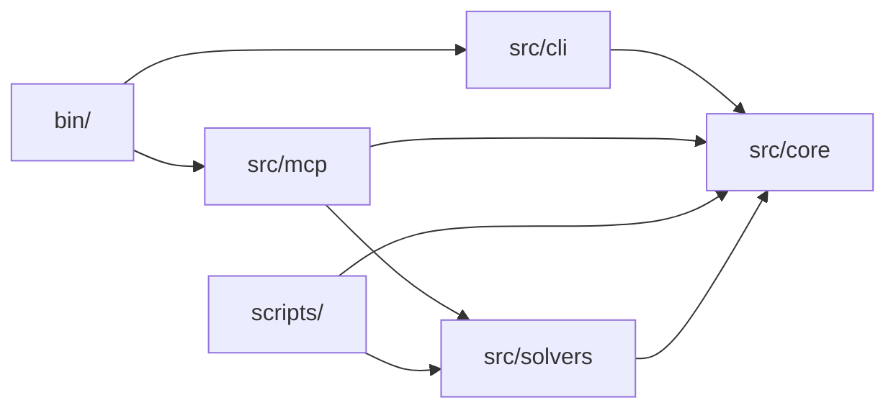

# symspec · System overview

`symspec` is a TypeScript proof-of-concept for an EARS-validated requirements graph: authors populate structured slots (pattern type, trigger, system response, etc.), the renderer produces the canonical EARS sentence, the storage layer keeps replicas eventually-consistent via Automerge, and a three-tier solver pipeline catches structural and semantic problems. The whole repo is one small core (`src/core`) plus three thin layers — surfaces (CLI + MCP), analysis, and solvers — composing on top (`README.md:42-65`). The intended consumer is an autonomous coding agent driving the MCP server during ERPAVal's CL-RIGOR substep, with a human reviewer reading the findings at Gate 1 (`integration/SKILL.md:117-126`).

The flat-map Automerge document keyed by UUID is the storage substrate (`src/core/doc.ts:24-31`). Mutations flow through one function, `applyChange(doc, change)`, which discriminates on the Change record's `kind` field and calls into Automerge's `change(...)` proxy (`src/core/doc.ts:58-160`). Every other module composes from the same atomic Zod field schemas in `src/core/schema.ts:199-257` — the discriminated-union `ChangeSchema` (`src/core/schema.ts:375-432`), the per-MCP-tool input shapes (`src/core/schema.ts:319-367`), and the on-disk `RequirementSchema` (`src/core/schema.ts:263-291`) all pull from `f`, so adding an attribute means editing exactly one place. The five EARS pattern types each render a specific sentence shape via `renderSentence()` (`src/core/schema.ts:443-464`); the analysis pass surfaces dangling references, missing slots, derive-cycles, and orphans on the converged snapshot (`src/core/analyze.ts:23-100`); the SysML-v2-flavored exporter projects each requirement into a `RequirementUsage`-shaped element with typed relationship elements (`src/core/sysml-export.ts:49-90`). Two surfaces wrap the core — a commander CLI (`src/cli/index.ts:34-205`, 11 subcommands) and an MCP stdio server (`src/mcp/server.ts:50-273`, 8 tools); both go through `applyChange`, so behavior parity is structural rather than maintained. The solver layer is its own slice: a deterministic free tier in `src/solvers/free/` catches exact duplicates, lexical weasel words, and emits candidate pairs (`src/solvers/index.ts:55-71`); an injectable `CallModel` Bedrock Converse client drives a two-model judge ensemble in `src/solvers/llm/` (`src/solvers/llm/bedrock-client.ts:48-107`); and Claude Opus 4.7 over `InvokeModel` arbitrates ensemble disagreements with adaptive thinking at `xhigh` effort (`src/solvers/llm/arbiter.ts:276-328`). Three smoke scripts under `scripts/` exercise concurrent merging, incremental edits, and the full solver pipeline against a deterministic mock or a live Bedrock account.

## Stack

| Layer | Technology | Source |
|---|---|---|
| Language | TypeScript 5.7 with strict + `noUncheckedIndexedAccess` + `exactOptionalPropertyTypes` | `package.json:48`, `tsconfig.json:6-9` |
| Runtime | Node ≥ 24, ESM | `package.json:31`, `package.json:5` |
| Storage | Automerge 2.2 (CRDT) | `package.json:35` |
| Validation | Zod 3.23 | `package.json:39` |
| LLM client | AWS SDK Bedrock Runtime 3.1045 | `package.json:36` |
| Agent surface | `@modelcontextprotocol/sdk` 1.0 over stdio | `package.json:37` |
| CLI framework | commander 12.1 | `package.json:38` |
| Test runner | vitest 4.0 + v8 coverage | `package.json:49`, `vitest.config.ts:3-13` |
| Lint + format | Biome 2.4 | `package.json:42`, `biome.json:14-29` |
| Dead-code | knip 5.85 | `package.json:45`, `knip.json:1-10` |
| Git hooks | lefthook 2.1 | `package.json:46`, `lefthook.yml:1-22` |
| Package manager | pnpm 11.1 | `package.json:7` |
| Tool versions | mise (Node 24, pnpm 11) | `mise.toml:2-3` |

## Module map

Edges are import-flow: every entry above the core depends on `src/core`'s `applyChange` / `analyze` / `exportSysml`; `src/solvers` reads `Doc` and `Requirement` types from `src/core` (`src/solvers/index.ts:14-22`).

## See also

- [Tech debt register](../insights/tech-debt.md)
- [Contract map](../insights/contract-map.md)
- [Debugging guide](../insights/debugging-guide.md)
- [Impact analysis](../insights/impact-analysis.md)
