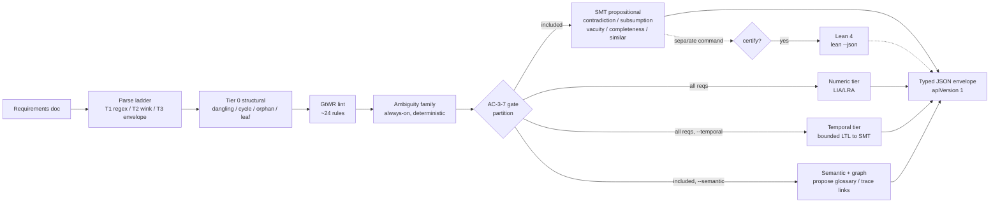

# symspec · System overview

symspec is a neurosymbolic validator for EARS (Easy Approach to Requirements Syntax) specifications, built so a coding agent writing a spec catches conflicts before they reach code. It takes a requirements document and runs it down a tiered pipeline that now spans five reasoning families, not one: Tier-0 structural analysis, INCOSE GtWR lint, an always-on deterministic ambiguity family, and a formal tier that layers propositional SMT (contradiction, subsumption, vacuity, completeness) with a numeric/arithmetic tier over LIA/LRA, an opt-in bounded temporal tier, and an opt-in embedding requirement-graph tier. The package describes itself as a "Neurosymbolic spec validator for coding agents: EARS requirements via regex-first parsing, INCOSE GtWR lint, and Z3 SMT formal conflict detection with unsat-core evidence, plus an optional local ONNX-WASM semantic paraphrase tier, optional Lean 4 certification, and an agent-friendly CLI" `package.json:6`. It ships library-first: every CLI command is a thin formatter over functions re-exported from the public entry point `src/index.ts:1-11`, and the single `symspec` bin is a two-line shim into `dist/cli.mjs` `bin/symspec.mjs:1-2`.

The design's load-bearing idea is a propose/decide split for anything neural. Deterministic tiers decide — structural, lint, ambiguity, and every formal-tier verdict (contradiction, numeric contradiction, temporal contradiction) emit stable `FND_*` codes with machine-checkable evidence, and the numeric/temporal verdicts run over ALL requirements rather than only the gate-included subset because their soundness does not depend on the propositional encoding the gate protects `src/pipeline/check.ts:388-419`. The embedding component only proposes: the `--semantic` paraphrase pass and the requirement graph emit info-only `FND_SIMILAR_SEMANTIC`, `FND_MISSING_TRACE_LINK`, and `FND_DUPLICATE_CLUSTER` findings whose sole durable effect is a suggested glossary or trace-link an agent may confirm; the SMT verdict path consults the committed glossary, never the model `src/formal/embed.ts:1-17`. The agent surface is the typed JSON envelope plus the self-describing `manifest` command `src/cli/index.ts:157` and generated AGENTS.md — there is no MCP server, a deletion a dedicated test asserts stays complete `src/cli/__tests__/no-mcp-surface.test.ts`.

## Stack

| Layer | Technology | Purpose |
|---|---|---|
| Language / runtime | TypeScript, ESM, Node >=24 | `"type": "module"`, `engines.node >= 24` `package.json:5,51-53` |
| CLI framework | commander ^14 | 16-command tree: `manifest`/`add`/`check`/`certify`/`parse`/`export`/glossary `src/cli/index.ts:156-675` |
| Validation | zod ^4 | Runtime schemas; `z.toJSONSchema` single-sources the manifest `src/cli/manifest.ts:370` |
| Formal (SMT) | z3-solver ^4.16 (Z3 WASM) | In-process contradiction/numeric (LIA/LRA)/temporal, no external binary `src/formal/backend.ts:12-16` |
| Embeddings | onnxruntime-web ^1.27 + @huggingface/tokenizers ^0.1 (pure-JS tokenizer) | Local `Xenova/bge-base-en-v1.5` ONNX-WASM sentence embedder, CLS-pooled + L2-norm `src/formal/embed.ts:6-17` |
| NL parse | wink-nlp ^2.4 + wink-eng-lite-web-model | Tier-2 POS clause repair, lazily loaded only on escalation `src/parse/tier2.ts:1-12` |
| Certification | Lean 4 (`lean --json`) | Optional kernel-checked elaboration; never on the `check` path `src/pipeline/check.ts:18-21` |
| Build | tsdown ^0.22 | Two entries: `index` (library) + `cli` `package.json:36` |
| Test | vitest ^4 | `vitest run` `package.json:40` |
| Lint / format | biome ^2.4 | `biome check .` `package.json:43` |
| Dead-code | knip ^6 | `knip` `package.json:45` |

## Check pipeline

The parse ladder climbs from a zero-dependency Tier-1 regex cascade `src/parse/tier1.ts:239`, to a lazily-imported Tier-2 wink-nlp clause repair that only loads on an escalation trigger `src/parse/tier2.ts:513`, to a Tier-3 structured `ERR_PARSE_*` error envelope when neither yields a full-slot parse `src/parse/tier3.ts:283`. `runCheck` wires the tiers into one report `src/pipeline/check.ts:311`: structural, GtWR lint, and the always-on ambiguity family run before the AC-3-7 gate partitions requirements `src/pipeline/check.ts:315-337`; the propositional SMT checks see only the gate-included subset, while the numeric and (opt-in) temporal tiers run over ALL requirements and the `--semantic` embedding graph runs over the included subset `src/pipeline/check.ts:372-453`. Unsat-triggered findings carry the atom table plus core as `evidence` `src/pipeline/check.ts:456-459`. The Z3 WASM module inits once per process (~110 ms measured) behind a memoized dynamic `import('z3-solver')`, so any lint-only or `add` path never pays the WASM load `src/formal/backend.ts:12-16,45-46`. Certification is a distinct command whose import graph `check` never touches — `check` succeeds on a machine with no Lean toolchain `src/pipeline/check.ts:18-21`.

## See also

- [symspec · Module map](module-map.md) — 12 shared source citations
- [symspec · Component diagram](../diagrams/architecture/components.md) — 9 shared source citations
- [symspec · Public API](../reference/public-api.md) — 8 shared source citations
- [symspec · Dependency graph](../diagrams/structural/dependency-graph.md) — 7 shared source citations
- [symspec · Processes](../behavior/processes.md) — 6 shared source citations
