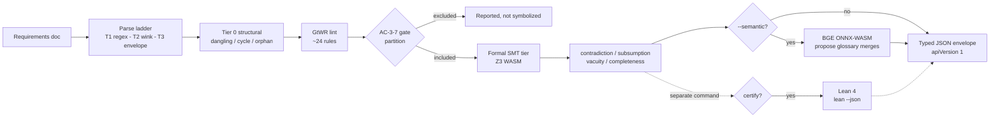

# symspec · System overview

symspec is a neurosymbolic validator for EARS (Easy Approach to Requirements Syntax) specifications, built so that a coding agent writing a spec can catch conflicts before they reach code. It takes a requirements document and runs it down a tiered pipeline — structural analysis, INCOSE GtWR lint, and a Z3 SMT formal tier — that surfaces contradictions, subsumption, vacuity, and completeness gaps as machine-checkable findings. The package description states the mission directly: a "Neurosymbolic spec validator for coding agents: EARS requirements via regex-first parsing, INCOSE GtWR lint, and Z3 SMT formal conflict detection with unsat-core evidence, plus optional Lean 4 certification and an agent-friendly CLI" `package.json:6`. It ships library-first: every CLI command is a thin formatter over functions re-exported from the public entry point `src/index.ts:1-11`, so an agent can `import { applyChange, analyze, checkGtWRules } from 'symspec'` and get the identical engine the `dist/cli.mjs` binary runs `src/index.ts:8-11`.

The design's load-bearing idea is a propose/decide split for anything semantic. Deterministic tiers (structural, lint, SMT) decide — they emit verdicts with stable codes and, in the formal tier, unsat-core evidence `src/pipeline/check.ts:369-385`. The optional embedding tier only proposes: it produces cosine similarity scores whose sole durable effect is a suggested glossary entry an agent may confirm; the SMT verdict path consults the committed glossary, never the model, so a run over (doc + glossary + pinned model) is reproducible `src/formal/embed.ts:28-34`. That boundary keeps the neural component out of the trust path while still letting it bridge paraphrased conflicts the symbolic atomizer would otherwise miss `src/pipeline/check.ts:357-367`.

## Stack

| Layer | Technology | Purpose |
|---|---|---|
| Language / runtime | TypeScript, ESM, Node >=24 | `"type": "module"`, `engines.node >= 24` `package.json:5,51-53` |
| CLI framework | commander ^14 | Command tree: `manifest`, `add`, `check`, `certify`, `parse`, glossary, export `src/cli/index.ts:157-662` |
| Validation | zod ^4 | Runtime schemas + `z.toJSONSchema` single-sources the manifest `src/cli/manifest.ts:9-16` |
| Formal (SMT) | z3-solver ^4.16 (Z3 WASM) | In-process contradiction/subsumption/vacuity, no external binary `src/formal/backend.ts:1-9` |
| Embeddings | onnxruntime-web ^1.27 + @huggingface/tokenizers ^0.1 | Local `bge-base-en-v1.5` ONNX-WASM sentence embedder, CLS-pooled `src/formal/embed.ts:1-12,40` |
| NL parse | wink-nlp ^2.4 + wink-eng-lite-web-model | Tier-2 POS clause repair, lazily loaded only on escalation `src/parse/tier2.ts:1-12` |
| Certification | Lean 4 (`lean --json`) | Optional kernel-checked proof of the encoded formulas `src/certify/run.ts:1-16` |
| Build | tsdown ^0.22 | Two entries: `index` (library) + `cli` `tsdown.config.ts:4-10` |
| Test | vitest ^4 | `vitest run` `package.json:40` |
| Lint / format | biome ^2.4 | `biome check .` `package.json:43` |
| Tooling | pnpm@11, mise, knip ^6, lefthook ^2 | Package mgr, dev-env, dead-code, git hooks `package.json:16,45-47`; `mise.toml`, `knip.json`, `lefthook.yml` |

Two source facts differ from a common shorthand. The GtWR engine implements `~24 T1 (regex/lexicon) checkable rules` (INCOSE-numbered `R1`..`R40`), not 73 — each carries a stable `GTWR_Rn` code, severity, span, and rewrite suggestion `src/lint/gtwr.ts:2-11`. The CLI's typed JSON envelope is versioned at `API_VERSION = 1`, a single constant the manifest and every envelope import so they cannot disagree `src/cli/envelope.ts:69`.

## Check pipeline

The parse ladder climbs from a zero-dependency Tier-1 regex cascade `src/parse/tier1.ts:1-6`, to a lazily-imported Tier-2 wink-nlp clause repair that only loads on an escalation trigger `src/parse/tier2.ts:6-12`, to a Tier-3 structured `ERR_PARSE_*` error envelope when neither yields a full-slot parse `src/parse/tier3.ts:1-8`. `runCheck` wires structural, lint, and formal tiers into one report in a forced `parse → lint → symbolize → solve` order; the gate partitions requirements before symbolization so an `error`-severity surface check excludes a statement from the SMT layer rather than feeding it unsound input `src/pipeline/check.ts:23-30,293-421`. Formal findings triggered by an unsat result carry the atom table plus core as `evidence` `src/pipeline/check.ts:369-385`. The Z3 WASM module inits once per process (~110 ms) behind a dynamic `import('z3-solver')`, so any lint-only or `add` path never pays the WASM load `src/formal/backend.ts:14-26,42-50`. Certification is a distinct command whose import graph the `check` pipeline never touches — `check` succeeds on a machine with no Lean toolchain `src/pipeline/check.ts:18-21`.

## See also

- [symspec · Module map](module-map.md) — 12 shared source citations
- [symspec · Component diagram](../diagrams/architecture/components.md) — 9 shared source citations
- [symspec · Public API](../reference/public-api.md) — 8 shared source citations
- [symspec · Dependency graph](../diagrams/structural/dependency-graph.md) — 7 shared source citations
- [symspec · Processes](../behavior/processes.md) — 6 shared source citations
