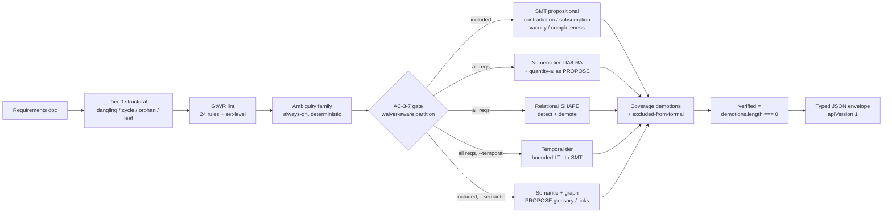

# symspec · System overview

symspec is a neurosymbolic validator for EARS (Easy Approach to Requirements Syntax) specifications, built so a coding agent writing a spec catches conflicts before they reach code. It takes a requirements document and runs it down a tiered pipeline that spans five reasoning families, not one: Tier-0 structural analysis, INCOSE GtWR lint, an always-on deterministic ambiguity family, and a formal tier that layers propositional SMT (contradiction, subsumption, vacuity, completeness) with a numeric/arithmetic tier over LIA/LRA, an opt-in bounded temporal tier, and an opt-in embedding requirement-graph tier. The package describes itself as a "Neurosymbolic spec validator for coding agents: EARS requirements via regex-first parsing, INCOSE GtWR lint, and Z3 SMT formal conflict detection with unsat-core evidence, plus an optional local ONNX-WASM semantic paraphrase tier, optional Lean 4 certification, and an agent-friendly CLI" `package.json:6`. It ships library-first: every CLI command is a thin formatter over functions re-exported from the public entry point `src/index.ts:1-11`, and the single `symspec` bin is a two-line shim into `dist/cli.mjs` `bin/symspec.mjs:1-2`.

## The doctrine — sound modulo atomization, enforced two ways

symspec's load-bearing rule is that it may MISS a conflict (a false negative — the honest direction) but must NEVER fabricate one. Two mechanisms enforce it, and they are the spine of the whole tool.

**PROPOSE / DECIDE split.** Fuzzy signals only ever PROPOSE. The `--semantic` paraphrase pass and requirement graph emit info-only `FND_SIMILAR_SEMANTIC`, `FND_MISSING_TRACE_LINK`, and `FND_DUPLICATE_CLUSTER`; their sole durable effect is a suggested glossary or trace-link an agent may confirm, and the SMT verdict path consults the committed glossary, never the model `src/formal/embed.ts:1-17`. The two blind-spot detectors added in issue #2 are propose-only by the same discipline: `findQuantityAliasCandidates` emits `FND_QUANTITY_ALIAS_CANDIDATE` carrying a ready-to-run `symspec glossary add` command but never asserts a conflict `src/formal/quantity-alias.ts:160`; `findRelationalUnchecked` recognizes the STRUCTURAL SHAPE of an aggregate/relational conflict and declines to certify, never claiming one exists `src/formal/relational.ts:100`. Only a committed, agent-reviewed artifact that the sound SMT layer consults can change a verdict toward proven-conflict.

**DEMOTION-ONLY.** Propose-only findings and coverage statistics may push the verdict toward abstention but never toward certification. The verdict is literally `verified = demotions.length === 0` `src/pipeline/check.ts:1289`, and every propose-only or coverage-gap code is enumerated in `PROPOSE_ONLY_FND_CODES` so it can raise the alarm without ever counting as a verification `src/pipeline/check.ts:413-441`. Only the deterministic decide tier — a z3 UNSAT result — promotes. `verified: false` is not a dead end but a work list: each `CoverageDemotion` names its discharging op (`glossary add` / `antonym add` / `waive` / rewrite), so applying them and re-running `check` converges to `verified: true` `src/pipeline/check.ts:277-289`.

The agent surface is the typed JSON envelope, the self-describing `manifest` command `src/cli/index.ts:234`, an optional `--field <paths>` jq-style projection over the same envelope `src/cli/field.ts:104`, and generated AGENTS.md — there is no MCP server, a deletion a dedicated test asserts stays complete `src/cli/__tests__/no-mcp-surface.test.ts`.

## Stack

| Layer | Technology | Purpose |
|---|---|---|
| Language / runtime | TypeScript, ESM, Node >=24 | `"type": "module"`, `engines.node >= 24` `package.json:5,52` |
| CLI framework | commander ^14 | 20 top-level commands: `manifest`/`add`/`check`/`certify`/`parse`/`export`/`glossary`/`antonym`/`waive` `src/cli/index.ts:234-1078` |
| Validation | zod ^4 | Runtime schemas; `z.toJSONSchema` single-sources the manifest `src/cli/manifest.ts:593` |
| Formal (SMT) | z3-solver ^4.16 (Z3 WASM) | In-process contradiction/numeric (LIA/LRA)/temporal, no external binary `src/formal/backend.ts:12-16` |
| Embeddings | onnxruntime-web ^1.27 + @huggingface/tokenizers ^0.1 (pure-JS tokenizer) | Local `Xenova/bge-base-en-v1.5` ONNX-WASM sentence embedder, CLS-pooled + L2-norm `src/formal/embed.ts:40` |
| NL parse | wink-nlp ^2.4 + wink-eng-lite-web-model | Tier-2 POS clause repair, lazily loaded only on escalation `src/parse/tier2.ts:652` |
| Certification | Lean 4 (`lean --json`) | Optional kernel-checked elaboration; never on the `check` path `src/pipeline/check.ts:18-21` |
| Build | tsdown ^0.22 | Two entries: `index` (library) + `cli` |
| Test | vitest ^4 | `vitest run` |
| Lint / format | biome ^2.4 | `biome ci .` |
| Dead-code | knip ^6 | `knip` |

## Check pipeline

`runCheck` wires the tiers in fixed order `src/pipeline/check.ts:678`: Tier-0 structural via `analyze` `src/pipeline/check.ts:682`, GtWR lint per-statement and set-level `src/pipeline/check.ts:684`, the always-on ambiguity family `src/pipeline/check.ts:691`, then the waiver-aware AC-3-7 gate partitions requirements before symbolization `src/pipeline/check.ts:708`. Inside the injected formal closure the propositional SMT checks see only the gate-included subset, while the numeric tier and the two propose-only blind-spot detectors run over ALL requirements, the opt-in bounded temporal tier runs over ALL requirements, and the `--semantic` embedding pass runs over the included subset `src/pipeline/check.ts:781-916`. Unsat-triggered findings carry the atom table plus core as `evidence` `src/pipeline/check.ts:930`. The gate is now waiver-aware: a committed waiver on a formal-blocking finding re-admits its requirement to the solver, so `gateResult.excluded` shrinks and the corresponding `FND_EXCLUDED_FROM_FORMAL` disclosure and demotion disappear `src/pipeline/gate.ts:134`. The Z3 WASM module inits once per process (~110 ms measured) behind a memoized dynamic `import('z3-solver')`, so any lint-only or `add` path never pays the WASM load `src/formal/backend.ts:12-16`. Certification is a distinct command whose import graph `check` never touches — `check` succeeds on a machine with no Lean toolchain `src/pipeline/check.ts:18-21`.

## Coverage is loud, not silent

The one place the tool's honesty gap used to bite was silence reading like a clean pass. Three disclosures close it, each info-severity but each demoting `verified`: `FND_NO_PAIRS_CHECKED` when two requirements existed but shared no atom `src/formal/coverage.ts:33`; `FND_EXCLUDED_FROM_FORMAL` for each requirement the gate dropped, driven by the gate's `excluded` set (NOT the post-waiver findings, so waiving the disclosure alone cannot restore coverage) `src/formal/coverage.ts:59`; and `FND_RELATIONAL_UNCHECKED` for the aggregate/relational shape the pairwise numeric tier does not attempt `src/formal/coverage.ts:93`. The finding-code enum now spans 30 append-only `FND_*` codes `src/formal/codes.ts:54-121`.

## See also

- [Module map](module-map.md) — 12 shared source citations
- [Processes](../behavior/processes.md) — 8 shared source citations
- [Component diagram](../diagrams/architecture/components.md) — 8 shared source citations
- [Contract map](../insights/contract-map.md) — 8 shared source citations
- [Debugging guide](../insights/debugging-guide.md) — 8 shared source citations
