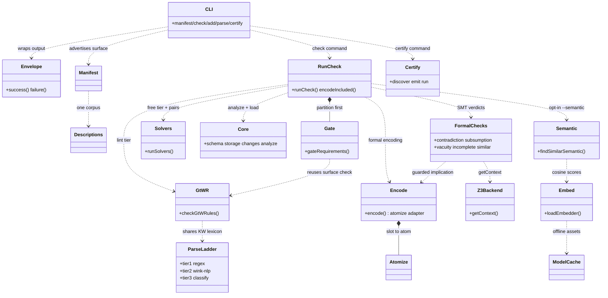

# symspec · Component diagram

symspec is an importable library first, CLI second: every CLI command is a thin formatter over functions the library barrel re-exports (`src/index.ts:5`). The barrel groups re-exports by subsystem, mirroring `src/`'s directory layout (`src/index.ts:22`). The load-bearing composition is the `check` pipeline (`runCheck`), which wires the structural, lint, and formal tiers into one report (`src/pipeline/check.ts:293`) while the AC-3-7 gate partitions requirements before symbolization so the SMT layer never sees unsound input (`src/pipeline/check.ts:303`). The formal tier deliberately never touches the Lean `certify` tier — `check` succeeds on a system with no Lean toolchain (`src/pipeline/check.ts:18`), and `certify` is the only command importing `src/certify/*` (`src/cli/index.ts:431`).

## Legend

| Node | Module(s) | Role | Cite |
|---|---|---|---|
| CLI | `src/cli/index.ts` | Commander program; thin formatter spine (resolve → load → core → save → envelope → emit) | `src/cli/index.ts:11` |
| Envelope | `src/cli/envelope.ts` | Typed JSON success/failure envelope, API version | `src/cli/envelope.ts:52` |
| Manifest | `src/cli/manifest.ts` | Machine-readable command + code catalog | `src/cli/manifest.ts:47` |
| Descriptions | `src/cli/descriptions.ts` | Single description corpus for help + manifest | `src/cli/index.ts:56` |
| RunCheck | `src/pipeline/check.ts` | Wires all tiers into one `CheckReport`; `encodeIncluded` for `.smt2` | `src/pipeline/check.ts:293` |
| Gate | `src/pipeline/gate.ts` | AC-3-7 exclusion partition before symbolization | `src/pipeline/gate.ts:34` |
| ParseLadder | `src/parse/tier1.ts`, `tier2.ts`, `tier3.ts` | Regex fast path → lazy wink-nlp repair → failure classifier | `src/parse/tier2.ts:41` |
| GtWR | `src/lint/gtwr.ts` | INCOSE GtWR per-statement + set-level lint | `src/lint/gtwr.ts:14` |
| Solvers | `src/solvers/index.ts` | Free-tier orchestrator (duplicates, ambiguity, pairwise filter) | `src/solvers/index.ts:26` |
| Core | `src/core/{schema,storage,changes,analyze}.ts` | Doc schema, atomic storage, Change API, Tier-0 structural analysis | `src/pipeline/check.ts:56` |
| Encode | `src/formal/encode.ts` | Guarded-implication formula AST; positional `atomize` adapter | `src/formal/encode.ts:48` |
| Atomize | `src/formal/atomize.ts` | Slot text → polarity-carrying atom; glossary + antonym index | `src/formal/atomize.ts:46` |
| Z3Backend | `src/formal/backend.ts` | Lazy `z3-solver` WASM context, cached per key | `src/formal/backend.ts:45` |
| FormalChecks | `src/formal/{contradiction,subsumption,vacuity,incomplete,similar,needs-review}.ts` | SMT verdicts over the included set | `src/pipeline/check.ts:339` |
| Semantic | `src/formal/semantic.ts` | Propose glossary merges for high-cosine pairs | `src/formal/semantic.ts:20` |
| Embed | `src/formal/embed.ts` | Local BGE-ONNX embedder (lazy, offline) | `src/formal/embed.ts:205` |
| ModelCache | `src/formal/model-cache.ts` | sha256-verified model asset download/cache | `src/formal/model-cache.ts:29` |
| Certify | `src/certify/{discover,emit,run}.ts` | Lean 4 toolchain discovery, emitter, NDJSON runner | `src/cli/index.ts:34` |

## See also

- [symspec · Module map](../../architecture/module-map.md) — 15 shared source citations
- [symspec · Contract map](../../insights/contract-map.md) — 10 shared source citations
- [symspec · Data flow](../../architecture/data-flow.md) — 9 shared source citations
- [symspec · Public API](../../reference/public-api.md) — 9 shared source citations
- [symspec · System overview](../../architecture/system-overview.md) — 9 shared source citations
