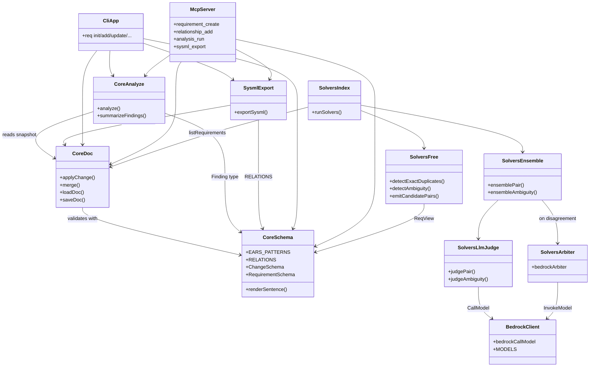

# symspec · Component diagram

A logical-component view: each box is one of the project's named modules; relationships show *uses* / *invokes*. Boxes are derived from the actual module structure under `src/` and `scripts/`.

## Legend

| Component | Source | Role |
|---|---|---|
| `CoreSchema` | `src/core/schema.ts:1` (512 LOC) | Single source of truth for atomic Zod fields, `ChangeSchema`, `RequirementSchema`, MCP tool input shapes, and `renderSentence()` |
| `CoreDoc` | `src/core/doc.ts:1` (189 LOC) | Automerge wrapper exposing `applyChange`, `merge`, `loadDoc`, `saveDoc`, `listRequirements` |
| `CoreAnalyze` | `src/core/analyze.ts:1` (152 LOC) | Structural analysis pass over a converged snapshot |
| `SysmlExport` | `src/core/sysml-export.ts:1` (90 LOC) | Project the doc to SysML-v2-flavored JSON |
| `CliApp` | `src/cli/index.ts:1` (205 LOC) | commander-based CLI |
| `McpServer` | `src/mcp/server.ts:1` (276 LOC) | `@modelcontextprotocol/sdk` stdio server with 8 tools |
| `SolversFree` | `src/solvers/free/duplicates.ts:1`, `src/solvers/free/ambiguity.ts:1`, `src/solvers/free/pairwise-filter.ts:1` | Deterministic in-process solvers |
| `SolversLlmJudge` | `src/solvers/llm/judge-pair.ts:1`, `src/solvers/llm/judge-ambiguity.ts:1` | Per-call Bedrock judges |
| `SolversEnsemble` | `src/solvers/llm/ensemble.ts:1` (263 LOC) | Two-model reconciliation logic |
| `SolversArbiter` | `src/solvers/llm/arbiter.ts:1` (328 LOC) | Opus 4.7 InvokeModel arbiter |
| `SolversIndex` | `src/solvers/index.ts:1` (124 LOC) | `runSolvers()` orchestrator |
| `BedrockClient` | `src/solvers/llm/bedrock-client.ts:1` (116 LOC) | Bedrock Converse-API wrapper, `CallModel` type |

## See also

- [Module map](../../architecture/module-map.md)
- [Public API](../../reference/public-api.md)
- [Processes](../../behavior/processes.md)
- [Business logic](../../insights/business-logic.md)
