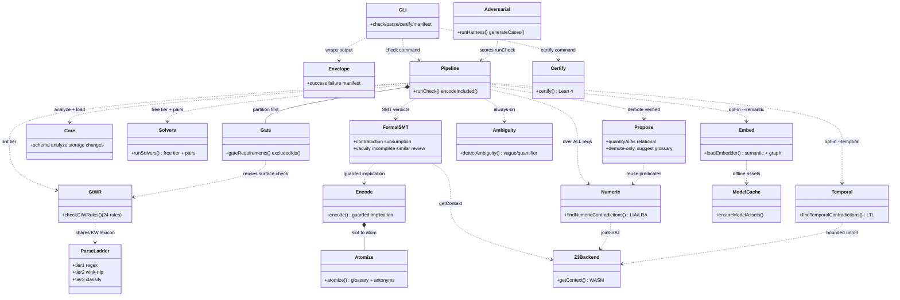

# symspec · Component diagram

symspec is an importable library first, CLI second: every CLI command is a thin formatter over functions the library barrel re-exports (`src/index.ts:11`). The load-bearing composition is the `check` pipeline (`runCheck`), which wires structural, lint, ambiguity, and formal tiers into one report and computes the `verified` verdict as `demotions.length === 0` (`src/pipeline/check.ts:678`, `src/pipeline/check.ts:1289`), while the AC-3-7 gate partitions requirements before symbolization so the propositional SMT layer never sees unsound input — now waiver-aware, so waiving a blocking lint re-admits the requirement (`src/pipeline/check.ts:708`). The formal component is no longer just SMT: it spans the propositional SMT checks, the numeric/LIA-LRA tier (`src/formal/numeric-contradiction.ts:55`), the always-on deterministic ambiguity family (`src/formal/ambiguity.ts:442`), the opt-in bounded temporal LTL→SMT tier (`src/formal/temporal.ts:118`), and the opt-in embedding semantic/graph tier (`src/formal/graph.ts:102`). A distinct PROPOSE layer of demotion-only signals — quantity-alias candidates (`src/formal/quantity-alias.ts:160`) and relational/aggregate blind-spot disclosures (`src/formal/relational.ts:100`) — can only push `verified` toward FALSE and suggest a `glossary add` alias; only the committed glossary then lets the sound numeric tier DECIDE (`src/formal/coverage.ts:59`). The formal tier deliberately never touches the Lean `certify` tier — `check` succeeds with no Lean toolchain, and `certify` is the only command importing `src/certify/*` (`src/cli/index.ts:439`). The `adversarial` harness drives `runCheck` over labelled bad-spec fixtures, and `evalRoundCases()` pins the red-team winning rounds as regression fixtures (`adversarial/harness.ts:75`, `adversarial/eval-rounds.ts:70`).

## Legend

| Node | Module(s) | Role | Cite |
|---|---|---|---|
| CLI | `src/cli/index.ts` | Commander program; thin formatter spine (16 commands) | `src/cli/index.ts:12` |
| Envelope | `src/cli/{envelope,manifest,descriptions}.ts` | Typed JSON success/failure envelope + machine-readable manifest | `src/cli/index.ts:412` |
| Pipeline | `src/pipeline/check.ts` | Wires all tiers into one `CheckReport`; computes `verified`; `encodeIncluded` for `.smt2` | `src/pipeline/check.ts:678` |
| Gate | `src/pipeline/gate.ts` | AC-3-7 waiver-aware exclusion partition before symbolization | `src/pipeline/check.ts:708` |
| Core | `src/core/{schema,analyze,storage,changes}.ts` | Doc schema, Tier-0 structural analysis, atomic storage, Change API | `src/pipeline/check.ts:56` |
| ParseLadder | `src/parse/{tier1,tier2,tier3}.ts` | Regex fast path → lazy wink-nlp repair → failure classifier | `src/parse/tier2.ts:42` |
| GtWR | `src/lint/gtwr.ts` | 24 INCOSE GtWR per-statement + set-level rules | `src/pipeline/check.ts:85` |
| Solvers | `src/solvers/index.ts` | Free-tier orchestrator (duplicates, weasel ambiguity, pairwise filter) | `src/pipeline/check.ts:86` |
| FormalSMT | `src/formal/{contradiction,subsumption,vacuity,incomplete,similar,needs-review}.ts` | Propositional SMT verdicts over the gate-included subset | `src/pipeline/check.ts:372` |
| Encode | `src/formal/encode.ts` | Guarded-implication formula AST; positional `atomize` adapter | `src/formal/encode.ts:205` |
| Atomize | `src/formal/atomize.ts` | Slot text → polarity-carrying atom; glossary + antonym index | `src/formal/atomize.ts:135` |
| Z3Backend | `src/formal/backend.ts` | Lazy `z3-solver` WASM context, shared by SMT/numeric/temporal | `src/formal/backend.ts:58` |
| Numeric | `src/formal/{numeric,numeric-contradiction}.ts` | v3.0 LIA/LRA numeric conflict tier, runs over ALL requirements | `src/formal/numeric-contradiction.ts:55` |
| Propose | `src/formal/{quantity-alias,relational,coverage}.ts` | Issue #2 demotion-only signals: `FND_QUANTITY_ALIAS_CANDIDATE` + `FND_RELATIONAL_UNCHECKED`, suggest `glossary add`, never a verdict | `src/formal/quantity-alias.ts:160` |
| Temporal | `src/formal/{temporal,temporal-patterns}.ts` | v3.3 bounded LTL→SMT tier (opt-in `--temporal`), sound-for-UNSAT | `src/formal/temporal.ts:118` |
| Ambiguity | `src/formal/ambiguity.ts` | v3.1 deterministic vague/quantifier/reference family, always-on | `src/formal/ambiguity.ts:442` |
| Embed | `src/formal/{embed,semantic,graph}.ts` | v3.1–v3.2 ONNX-WASM embedder + semantic paraphrase + kNN graph (opt-in `--semantic`) | `src/formal/graph.ts:102` |
| ModelCache | `src/formal/model-cache.ts` | sha256-verified model asset download/cache | `src/formal/model-cache.ts:177` |
| Certify | `src/certify/{discover,emit,run}.ts` | Lean 4 toolchain discovery, emitter, NDJSON runner (never on check path) | `src/certify/run.ts:305` |
| Adversarial | `adversarial/{generate,harness,eval-rounds}.ts` | v3.4 generative-adversarial harness + pinned red-team regression fixtures | `adversarial/eval-rounds.ts:70` |

## See also

- [Module map](../../architecture/module-map.md) — 15 shared source citations
- [Processes](../../behavior/processes.md) — 13 shared source citations
- [Contract map](../../insights/contract-map.md) — 11 shared source citations
- [Public API](../../reference/public-api.md) — 10 shared source citations
- [Business logic](../../insights/business-logic.md) — 9 shared source citations
