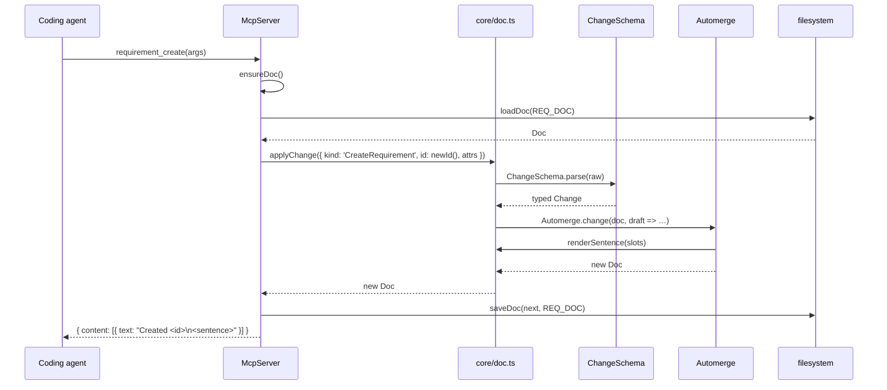
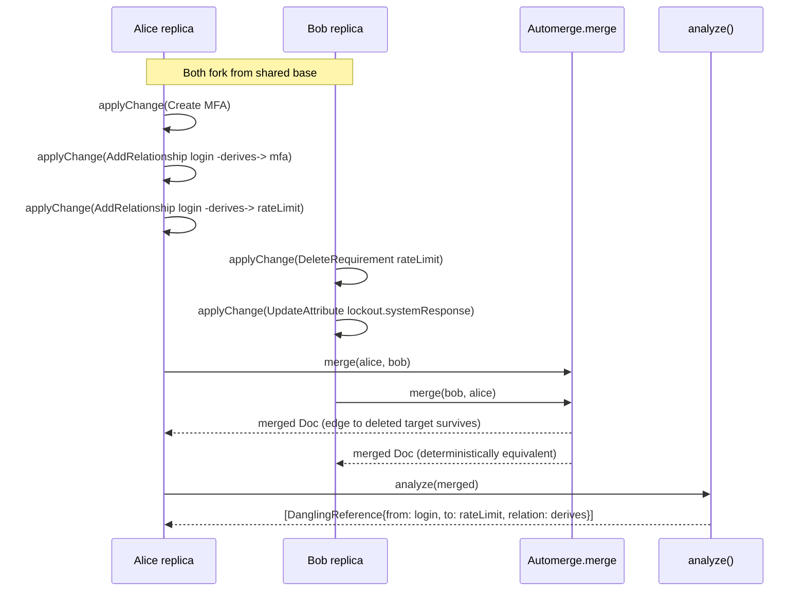
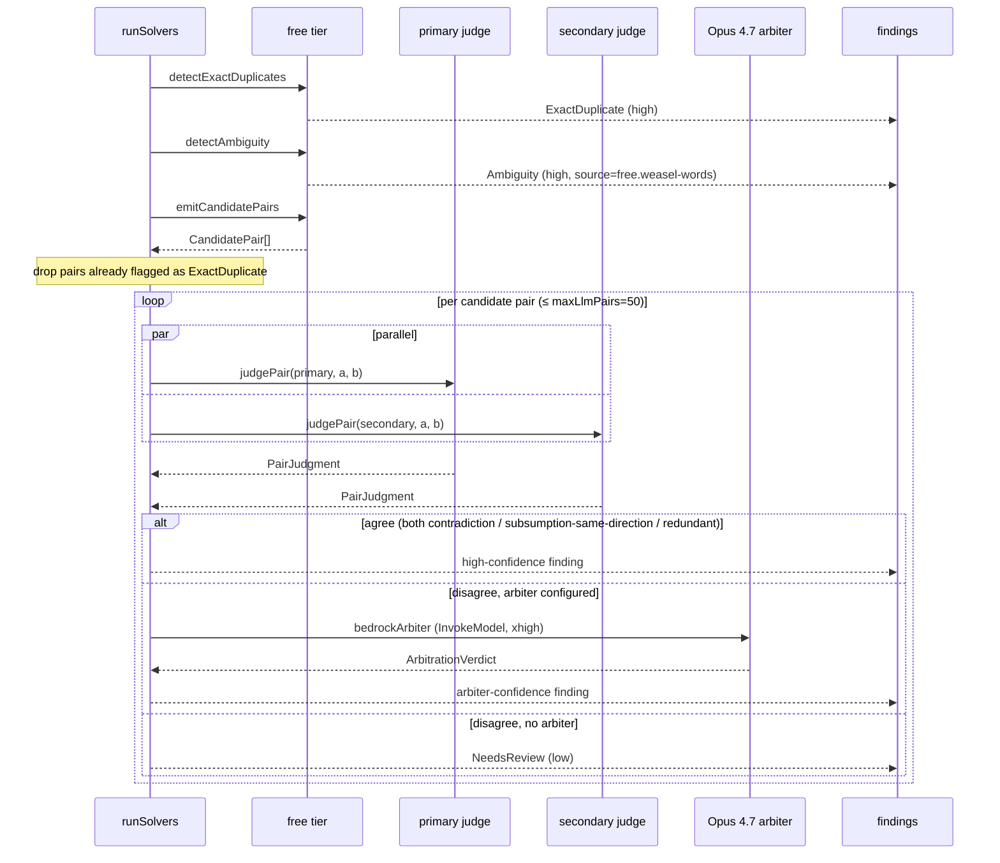

# symspec · Behavioral sequences

Three sequences capture the call order of the system's most important processes. The full step-by-step prose lives in `behavior/processes.md`. The diagrams below are the visual companion.

The first sequence covers the hot path through the MCP surface, from agent tool call to disk and back. An agent invokes the `requirement_create` tool. The MCP server ensures the doc exists, loads it from disk, applies the Change record through the core wrapper, and saves the result. The Change is schema-validated by Zod before Automerge opens its proxy callback. Inside the callback, the canonical sentence is rendered from the EARS slots. The agent receives a confirmation block carrying the new id and the rendered sentence. Source for this flow lives at `src/mcp/server.ts:70-89` and `src/core/doc.ts:58-100`.

The second sequence covers concurrent merge with dangling-reference convergence. Two replicas fork from a shared base. Alice creates a new requirement and adds two outbound edges. One of those edges points at a node Bob is about to delete. Bob deletes that node and updates an attribute on a third node. Both replicas then merge against each other. Automerge resolves the merge deterministically. The edge Alice added survives even though its target is gone. Calling `analyze` on the merged doc surfaces the dangling reference as a finding. Source: `scripts/smoke.ts:79-198` and `src/core/analyze.ts:30-43`.

The third sequence covers the three-tier solver pipeline with arbiter escalation. The free tier runs first. It catches exact duplicates and weasel-word ambiguity, both at high confidence. It also emits the candidate pairs worth running through the LLM tier. Pairs already flagged as exact duplicates are dropped. For each remaining candidate, the orchestrator runs the primary judge and the secondary judge in parallel. When both judges agree, a high-confidence finding is emitted. When they disagree, behavior depends on whether an arbiter is configured. With an arbiter, Opus 4.7 runs at `xhigh` effort and the resulting verdict drives the finding. Without an arbiter, the disagreement becomes a low-confidence `NeedsReview` finding that humans handle. The cap is `maxLlmPairs`, default 50. Source: `src/solvers/index.ts:55-110`, `src/solvers/llm/ensemble.ts:39-80`, and `src/solvers/llm/arbiter.ts:276-328`.

## See also

- [Data flow](../../architecture/data-flow.md)
- [Module map](../../architecture/module-map.md)
- [Processes](../../behavior/processes.md)
- [Dead code](../../analysis/dead-code.md)
