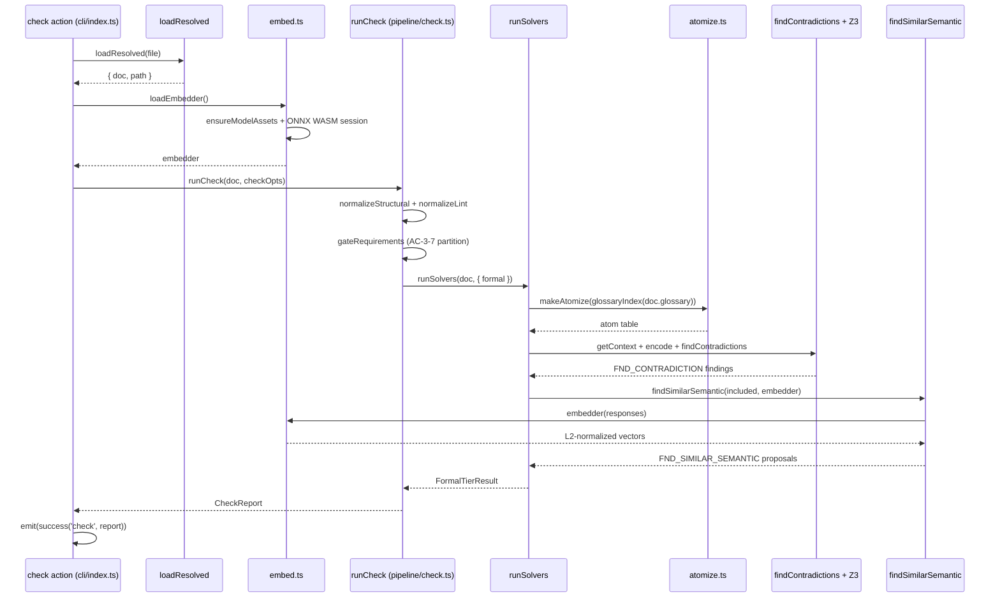
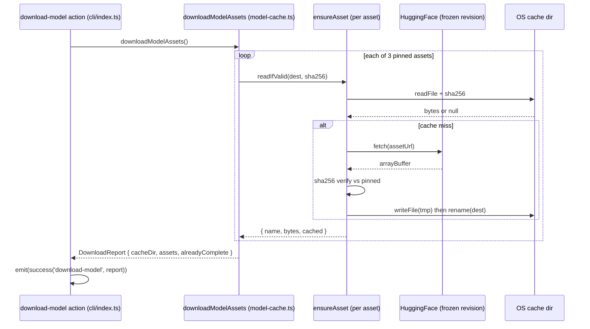
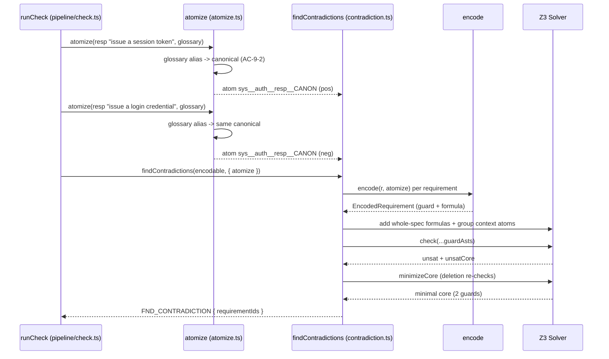

# symspec · Sequence diagrams

## 1. `symspec check --semantic` end to end

The `check` action resolves and loads the document, then — only because `--semantic` is set — lazily imports and builds the embedder before running the pipeline (`src/cli/index.ts:353-366`). `runCheck` runs the tiers in a forced order: structural, then GtWR lint, then the AC-3-7 gate partition, then the formal tier inside the solver orchestrator (`src/pipeline/check.ts:293-398`). Inside the formal callback it atomizes through the committed glossary, gets the shared Z3 context, and calls `findContradictions` plus the other SMT checks (`src/pipeline/check.ts:326-353`). The semantic pass is propose-only: it embeds responses via the loaded ONNX-WASM model and scores cosine similarity, never a verdict (`src/pipeline/check.ts:359-367`, `src/formal/embed.ts:218-236`). The result is wrapped in a `success('check', ...)` envelope and emitted with the AC-6-2b exit code (`src/cli/index.ts:397-404`, `src/cli/index.ts:91-98`).

## 2. `symspec download-model`

The `download-model` action calls `downloadModelAssets`, which force-fetches every pinned asset into the OS cache and reports which were already present (`src/cli/index.ts:664-672`). For each of the three pinned assets it first checks the cache for a digest-valid copy, then fetches from the frozen HF revision, verifies the sha256, and atomically publishes via a temp-file rename (`src/formal/model-cache.ts:218-237`, `src/formal/model-cache.ts:134-170`). A digest mismatch or network failure raises `ModelAssetsUnavailableError`, which the action maps to an `ERR_EMBED_MODEL_MISSING` envelope; success emits the `DownloadReport` (`src/formal/model-cache.ts:155-161`, `src/cli/index.ts:667-671`).

## 3. Atomize → SMT contradiction proof for a paraphrased conflict

A paraphrased conflict is only provable because the glossary canonicalizes the two differently-worded responses to one atom before the solver sees them. `runCheck` builds the atomizer from `glossaryIndex(doc.glossary)` (`src/pipeline/check.ts:326`), and `atomize` applies glossary canonicalization FIRST — rewriting a matched alias body to its canonical phrasing — then antonym unification, so both responses resolve to the same scoped atom name (`src/formal/atomize.ts:135-165`). `findContradictions` encodes the requirements, groups by context atoms, asserts each group's context true over the whole-spec conjunction, and checks with the requirement guards as the only assumption literals (`src/formal/contradiction.ts:229-293`). On `unsat` it extracts and minimizes the core to exactly the conflicting ids and emits one `FND_CONTRADICTION` (`src/formal/contradiction.ts:293-322`, `src/formal/contradiction.ts:189-212`).

## See also

- [symspec · Data flow](../../architecture/data-flow.md) — 6 shared source citations
- [symspec · Module map](../../architecture/module-map.md) — 6 shared source citations
- [symspec · Component diagram](../architecture/components.md) — 5 shared source citations
- [symspec · Contract map](../../insights/contract-map.md) — 5 shared source citations
- [symspec · Public API](../../reference/public-api.md) — 5 shared source citations
