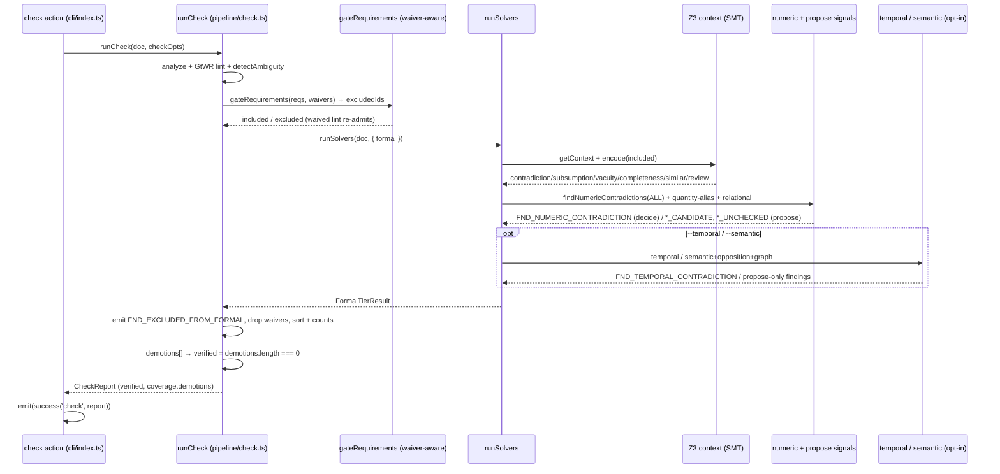
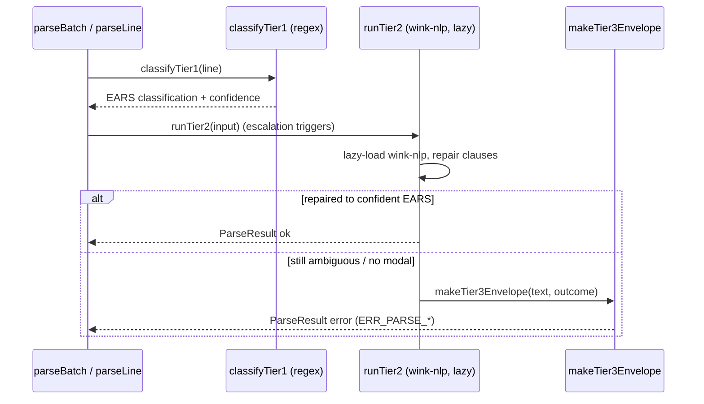
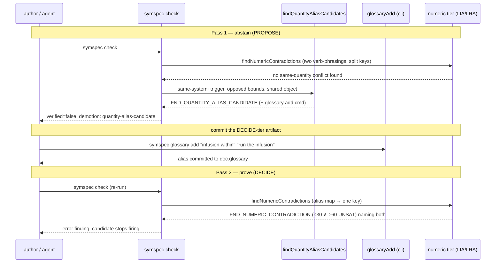

# symspec · Sequence diagrams

## 1. `symspec check` end to end (all tiers)

`runCheck` runs the tiers in a forced order: Tier-0 structural analyze, GtWR lint, the always-on deterministic ambiguity family, then the waiver-aware AC-3-7 gate partition, then the free + formal tiers inside `runSolvers` (`src/pipeline/check.ts:682-1006`). Inside the formal callback it atomizes through the committed glossary + antonyms, gets the shared Z3 context, and runs contradiction/subsumption/vacuity/completeness/similar/needs-review over the gate-included subset (`src/pipeline/check.ts:781-795`). The numeric tier and the two propose-only signals (quantity-alias, relational-unchecked) run over ALL requirements, because those are independent of the propositional-encoding soundness the gate protects (`src/pipeline/check.ts:822`, `src/pipeline/check.ts:835`, `src/pipeline/check.ts:856`). The temporal tier runs only when `--temporal` is set, and the semantic + opposition + graph passes only when `--semantic` is set — all propose-only (`src/pipeline/check.ts:871`, `src/pipeline/check.ts:884-927`). Back in `runCheck`, one `FND_EXCLUDED_FROM_FORMAL` per gate-excluded requirement is emitted (`src/pipeline/check.ts:1030`), waivers are dropped, and `verified` is computed as `demotions.length === 0` — a demotion-only verdict where propose signals and coverage gaps can only push it FALSE (`src/pipeline/check.ts:1289`). The report is wrapped in a `success('check', ...)` envelope with the exit code from `exitCodeForEnvelope` (`src/cli/index.ts:632`, `src/cli/index.ts:161`).

## 2. Parse ladder (Tier 1 → Tier 2 → Tier 3)

A single line parses through an escalation ladder: `parseLine` runs the Tier-1 regex classifier, escalates to the lazy wink-nlp Tier-2 repair only when triggers fire, and falls to the Tier-3 failure classifier when neither yields a confident EARS structure (`src/parse/result.ts:258`, `src/parse/result.ts:259`, `src/parse/result.ts:237`). Tier 2 lazy-loads `wink-nlp` and reuses the Tier-1 keyword lexicon (`src/parse/tier2.ts:42`); Tier 3 emits a discriminated failure envelope with a stable `ERR_PARSE_*` code (`src/parse/tier3.ts:283`).

## 3. The PROPOSE → DECIDE author loop (issue #2)

The two-pass loop that closes reproducer-a. Pass 1: one physical quantity phrased two ways ("complete the infusion within ≤30 min" vs "run the infusion for ≥60 min") splits onto two quantity keys, so the numeric tier never compares them; `findQuantityAliasCandidates` fires a propose-only `FND_QUANTITY_ALIAS_CANDIDATE` that DEMOTES `verified` and carries the exact `glossary add` command (`src/formal/quantity-alias.ts:160`, `src/pipeline/check.ts:835`). The author commits the alias via `glossaryAdd` (`src/cli/glossary.ts:58`) — the only step that touches the decide-tier surface. Pass 2: the committed glossary is passed as the numeric quantity-alias map, `quantityKey` canonicalizes both labels to one key (`src/pipeline/check.ts:809`, `src/formal/numeric.ts:170`), and the LIA/LRA solver proves `FND_NUMERIC_CONTRADICTION` (≤30 ∧ ≥60 UNSAT). A fuzzy signal only proposed; only the sound solver decided. Pinned as a regression fixture (`adversarial/eval-rounds.ts:589`).

## See also

- [Module map](../../architecture/module-map.md) — 8 shared source citations
- [Processes](../../behavior/processes.md) — 8 shared source citations
- [System overview](../../architecture/system-overview.md) — 4 shared source citations
- [Component diagram](../architecture/components.md) — 4 shared source citations
- [Business logic](../../insights/business-logic.md) — 4 shared source citations
