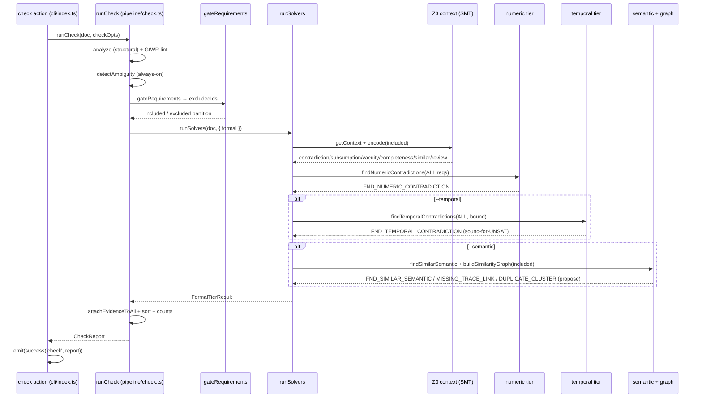
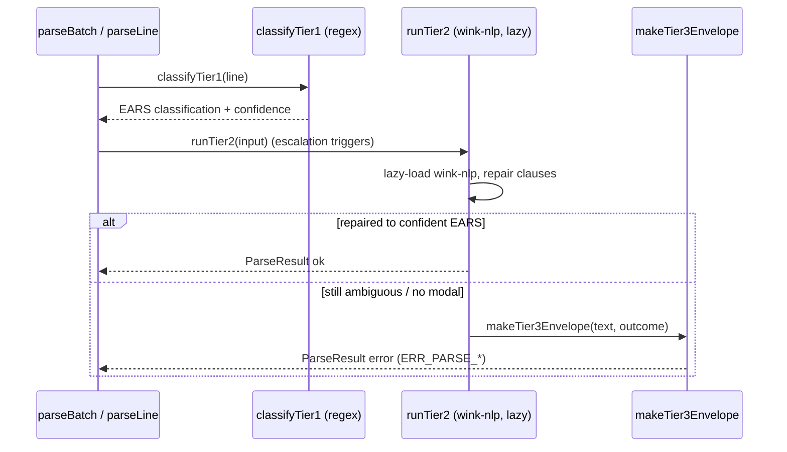
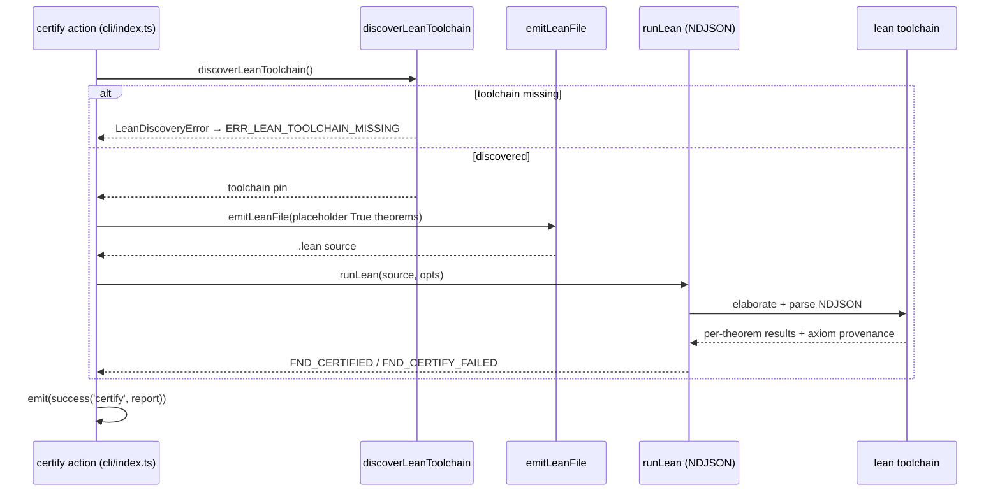

# symspec · Sequence diagrams

## 1. `symspec check` end to end (all tiers)

`runCheck` runs the tiers in a forced order: Tier-0 structural analyze, GtWR lint, the always-on deterministic ambiguity family, then the AC-3-7 gate partition, then the free + formal tiers inside `runSolvers` (`src/pipeline/check.ts:311-459`). Inside the formal callback it atomizes through the committed glossary, gets the shared Z3 context, and runs contradiction/subsumption/vacuity/completeness/similar/needs-review over the gate-included subset (`src/pipeline/check.ts:372-386`). The numeric tier runs over ALL requirements, not the gate subset, because numeric conflict is independent of the propositional-encoding soundness the gate protects (`src/pipeline/check.ts:396-406`). The temporal tier runs only when `--temporal` is set, mapping EARS→LTL and proving bounded contradictions on the same context (`src/pipeline/check.ts:412-419`); the semantic + graph passes run only when `--semantic` is set and are propose-only (`src/pipeline/check.ts:425-453`). Finally unsat-triggered findings gain atom-table + core evidence (`src/pipeline/check.ts:456`) and the report is wrapped in a `success('check', ...)` envelope with the AC-6-2b exit code (`src/cli/index.ts:412`, `src/cli/index.ts:97`).

## 2. Parse ladder (Tier 1 → Tier 2 → Tier 3)

A single line parses through an escalation ladder: `parseLine` runs the Tier-1 regex classifier, escalates to the lazy wink-nlp Tier-2 repair only when triggers fire, and falls to the Tier-3 failure classifier when neither yields a confident EARS structure (`src/parse/result.ts:258`, `src/parse/result.ts:259`, `src/parse/result.ts:237`). Tier 2 lazy-loads `wink-nlp` and reuses the Tier-1 keyword lexicon (`src/parse/tier2.ts:42`); Tier 3 emits a discriminated failure envelope with a stable `ERR_PARSE_*` code (`src/parse/tier3.ts:283`).

## 3. `symspec certify` (Lean 4, opt-in)

`certify` is the only command touching `src/certify/*`; it loads the document, discovers the Lean toolchain (raising `ERR_LEAN_TOOLCHAIN_MISSING` on a miss), emits a `.lean` file, and runs Lean over it as an NDJSON stream (`src/cli/index.ts:434`, `src/certify/run.ts:305`, `src/certify/run.ts:310`, `src/certify/run.ts:322`). Each requirement is emitted as a placeholder `True` theorem — this attests the toolchain elaborates, NOT requirement semantics (`src/cli/index.ts:794-807`). It emits `FND_CERTIFIED` / `FND_CERTIFY_FAILED`.

## See also

- [symspec · Data flow](../../architecture/data-flow.md) — 6 shared source citations
- [symspec · Module map](../../architecture/module-map.md) — 6 shared source citations
- [symspec · Component diagram](../architecture/components.md) — 5 shared source citations
- [symspec · Contract map](../../insights/contract-map.md) — 5 shared source citations
- [symspec · Public API](../../reference/public-api.md) — 5 shared source citations
