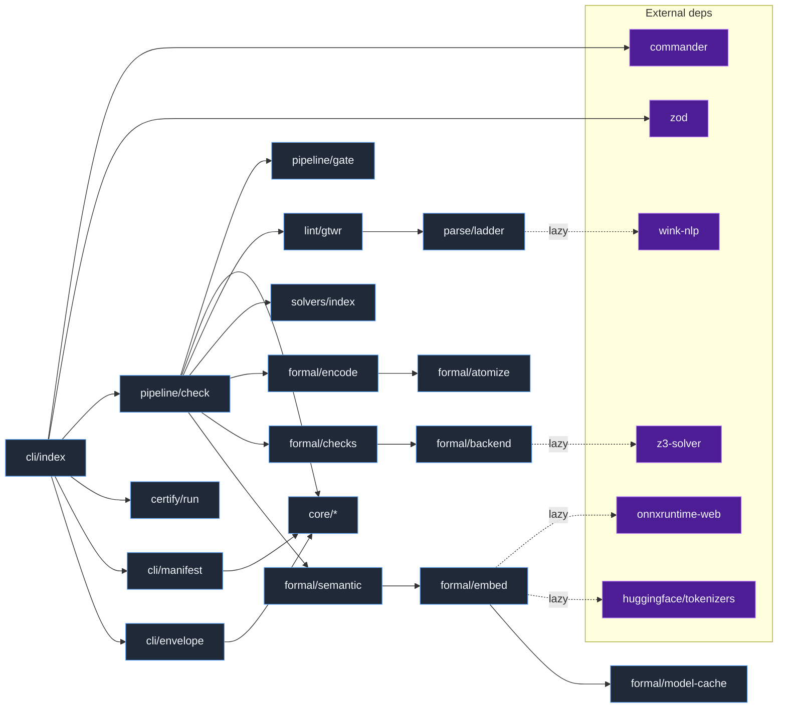

# symspec · Dependency graph

Internal `src/` modules and their key external npm dependencies, with edges pointing from importer to imported. The public barrel `src/index.ts` re-exports every subsystem (`src/index.ts:51`). The CLI depends on `commander` (`src/cli/index.ts:32`) and `zod` (`src/cli/index.ts:33`), and dispatches into the `check` pipeline (`src/cli/index.ts:53`). The four heavy externals are all lazily imported so the default `check` never pays their cost: `z3-solver` via `await import('z3-solver')` (`src/formal/backend.ts:45`), `onnxruntime-web` + `@huggingface/tokenizers` inside the embedder factory (`src/formal/embed.ts:109`), and `wink-nlp` only on parse escalation (`src/parse/tier2.ts:2`). Runtime dependencies are exactly `@huggingface/tokenizers`, `onnxruntime-web`, `wink-eng-lite-web-model`, `wink-nlp`, and `z3-solver` (`package.json:55`); `commander` and `zod` are devDependencies bundled at build (`package.json:62`).

Dotted edges (`-.lazy.->`) are dynamic `import()` calls loaded on demand, not at module load.

## Legend

| Node | Type | Module / package | Cite |
|---|---|---|---|
| cli/index | internal | `src/cli/index.ts` | `src/cli/index.ts:31` |
| pipeline/check | internal | `src/pipeline/check.ts` | `src/cli/index.ts:53` |
| pipeline/gate | internal | `src/pipeline/gate.ts` | `src/pipeline/check.ts:82` |
| core/* | internal | `src/core/{doc,analyze,schema,render,storage,changes}.ts` | `src/pipeline/check.ts:56` |
| lint/gtwr | internal | `src/lint/gtwr.ts` | `src/pipeline/check.ts:79` |
| solvers/index | internal | `src/solvers/index.ts` | `src/pipeline/check.ts:80` |
| formal/encode | internal | `src/formal/encode.ts` | `src/pipeline/check.ts:66` |
| formal/atomize | internal | `src/formal/atomize.ts` | `src/pipeline/check.ts:61` |
| formal/checks | internal | contradiction/subsumption/vacuity/incomplete/similar/needs-review | `src/pipeline/check.ts:64` |
| formal/backend | internal | `src/formal/backend.ts` (Z3 WASM context) | `src/formal/backend.ts:45` |
| formal/semantic | internal | `src/formal/semantic.ts` | `src/formal/semantic.ts:20` |
| formal/embed | internal | `src/formal/embed.ts` | `src/formal/embed.ts:205` |
| formal/model-cache | internal | `src/formal/model-cache.ts` | `src/formal/model-cache.ts:29` |
| parse/ladder | internal | `src/parse/{tier1,tier2,tier3}.ts` | `src/parse/tier2.ts:41` |
| certify/run | internal | `src/certify/run.ts` | `src/cli/index.ts:36` |
| commander | external | `commander@^14` (dev, bundled) | `package.json:66` |
| zod | external | `zod@^4` (dev, bundled) | `package.json:73` |
| z3-solver | external | `z3-solver@^4.16` (runtime, lazy) | `package.json:60` |
| onnxruntime-web | external | `onnxruntime-web@^1.27` (runtime, lazy) | `package.json:57` |
| @huggingface/tokenizers | external | `@huggingface/tokenizers@^0.1.3` (runtime, lazy) | `package.json:56` |
| wink-nlp | external | `wink-nlp@^2.4` + `wink-eng-lite-web-model` (runtime, lazy) | `package.json:58` |

## See also

- [symspec · Component diagram](../architecture/components.md) — 8 shared source citations
- [symspec · Module map](../../architecture/module-map.md) — 8 shared source citations
- [symspec · System overview](../../architecture/system-overview.md) — 7 shared source citations
- [symspec · Contract map](../../insights/contract-map.md) — 6 shared source citations
- [symspec · Data flow](../../architecture/data-flow.md) — 6 shared source citations
