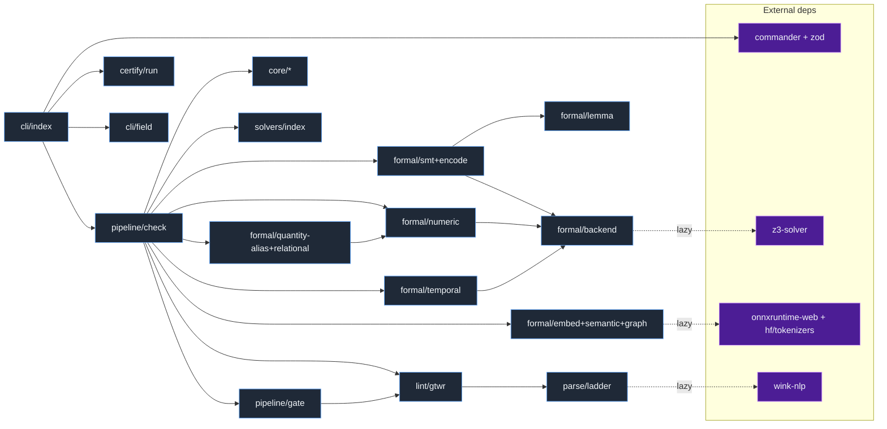

# symspec · Dependency graph

Internal `src/` modules and their key external npm dependencies, with edges pointing from importer to imported. The CLI depends on `commander` + `zod` and dispatches into the `check` pipeline (`src/cli/index.ts:53`). Every heavy external is lazily imported so the default `check` never pays their cost: `z3-solver` via `await import('z3-solver')` (`src/formal/backend.ts`), `onnxruntime-web` + `@huggingface/tokenizers` inside the embedder factory (`src/formal/embed.ts`), and `wink-nlp` only on parse escalation (`src/parse/tier2.ts`). Runtime dependencies are exactly `@huggingface/tokenizers`, `onnxruntime-web`, `wink-eng-lite-web-model`, `wink-nlp`, and `z3-solver` (`package.json:55-61`); `commander` and `zod` are devDependencies bundled at build (`package.json:66`, `package.json:73`). The issue-#2 modules add internal edges but NO new external ones — they are pure/deterministic: `formal/quantity-alias` and `formal/relational` are the propose-only signals wired off the numeric tier's predicates (`src/pipeline/check.ts:835`, `src/pipeline/check.ts:856`); `formal/lemma` is a vendored de-inflection table imported by `atomize` + `guard-implication` (`src/formal/atomize.ts:60`, `src/formal/guard-implication.ts:61`); `cli/field` is a pure `--field` output projection imported by the CLI (`src/cli/index.ts:63`). The always-on `formal/ambiguity` tier (`src/pipeline/check.ts:691`) has no external edge and is omitted from the diagram; it depends only on `core` + `atomize`.

Dotted edges (`-.lazy.->`) are dynamic `import()` calls loaded on demand, not at module load. `propose --> numeric` and `gate --> gtwr` are reuse edges (the propose signals consume the numeric tier's extracted predicates; the gate reuses the GtWR surface check).

## Legend

| Node | Type | Module / package | Cite |
|---|---|---|---|
| cli/index | internal | `src/cli/index.ts` | `src/cli/index.ts:53` |
| cli/field | internal | `src/cli/field.ts` (`--field` jq-style output projection) | `src/cli/index.ts:63` |
| pipeline/check | internal | `src/pipeline/check.ts` | `src/pipeline/check.ts:678` |
| pipeline/gate | internal | `src/pipeline/gate.ts` (waiver-aware) | `src/pipeline/check.ts:96` |
| core/* | internal | `src/core/{doc,analyze,schema,render}.ts` | `src/pipeline/check.ts:56` |
| lint/gtwr | internal | `src/lint/gtwr.ts` | `src/pipeline/check.ts:93` |
| solvers/index | internal | `src/solvers/index.ts` | `src/pipeline/check.ts:94` |
| formal/smt+encode | internal | `src/formal/{encode,atomize,contradiction,subsumption,vacuity,incomplete,similar,needs-review}.ts` | `src/pipeline/check.ts:66` |
| formal/lemma | internal | `src/formal/lemma.ts` (vendored verb de-inflection for atomize + guard-implication) | `src/formal/atomize.ts:60` |
| formal/numeric | internal | `src/formal/{numeric,numeric-contradiction}.ts` (LIA/LRA, over ALL reqs) | `src/pipeline/check.ts:83` |
| formal/quantity-alias+relational | internal | `src/formal/{quantity-alias,relational,coverage}.ts` (issue #2 propose-only, demote-only) | `src/pipeline/check.ts:85` |
| formal/temporal | internal | `src/formal/{temporal,temporal-patterns}.ts` (opt-in `--temporal`) | `src/pipeline/check.ts:90` |
| formal/ambiguity | internal | `src/formal/ambiguity.ts` (always-on; omitted from diagram, no external edge) | `src/pipeline/check.ts:61` |
| formal/embed+semantic+graph | internal | `src/formal/{embed,semantic,graph,model-cache}.ts` (opt-in `--semantic`) | `src/pipeline/check.ts:80` |
| formal/backend | internal | `src/formal/backend.ts` (shared Z3 WASM context) | `src/pipeline/check.ts:64` |
| parse/ladder | internal | `src/parse/{tier1,tier2,tier3}.ts` | `src/parse/tier2.ts:42` |
| certify/run | internal | `src/certify/run.ts` (only `certify` reaches it) | `src/cli/index.ts:439` |
| commander + zod | external | `commander@^14` + `zod@^4` (dev, bundled at build) | `package.json:66` |
| z3-solver | external | `z3-solver@^4.16` (runtime, lazy; SMT + numeric + temporal) | `package.json:60` |
| onnxruntime-web + hf/tokenizers | external | `onnxruntime-web@^1.27` + `@huggingface/tokenizers@^0.1.3` (runtime, lazy; embed → semantic + graph) | `package.json:57` |
| wink-nlp | external | `wink-nlp@^2.4` + `wink-eng-lite-web-model` (runtime, lazy) | `package.json:59` |

## See also

- [Module map](../../architecture/module-map.md) — 4 shared source citations
- [Component diagram](../architecture/components.md) — 4 shared source citations
- [System overview](../../architecture/system-overview.md) — 3 shared source citations
- [Processes](../../behavior/processes.md) — 3 shared source citations
- [Sequence diagrams](../behavioral/sequences.md) — 3 shared source citations
